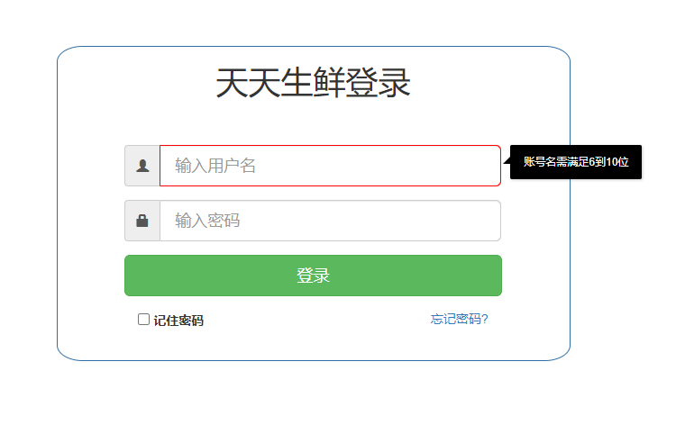
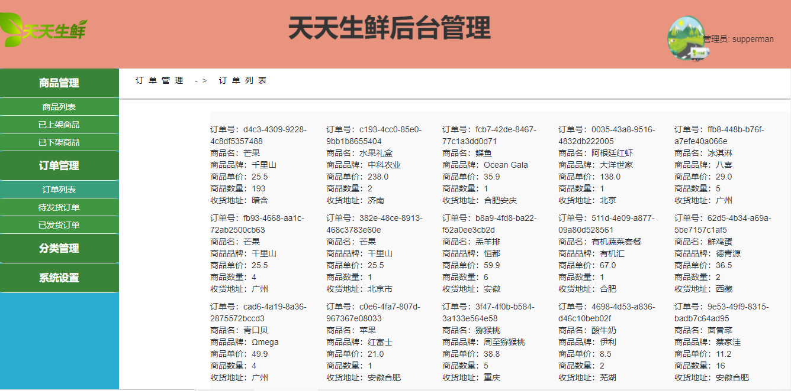
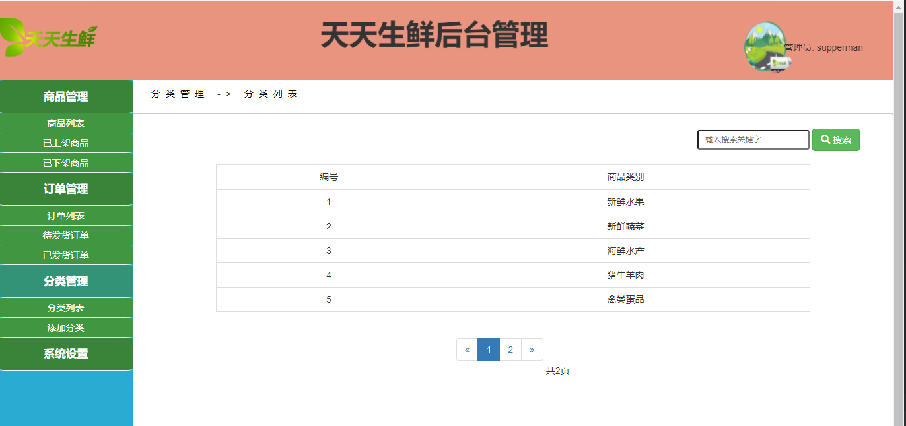
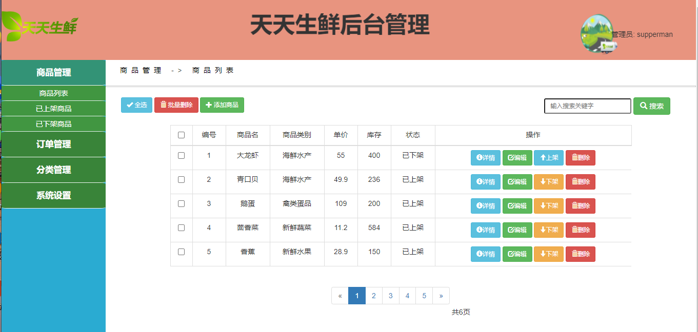
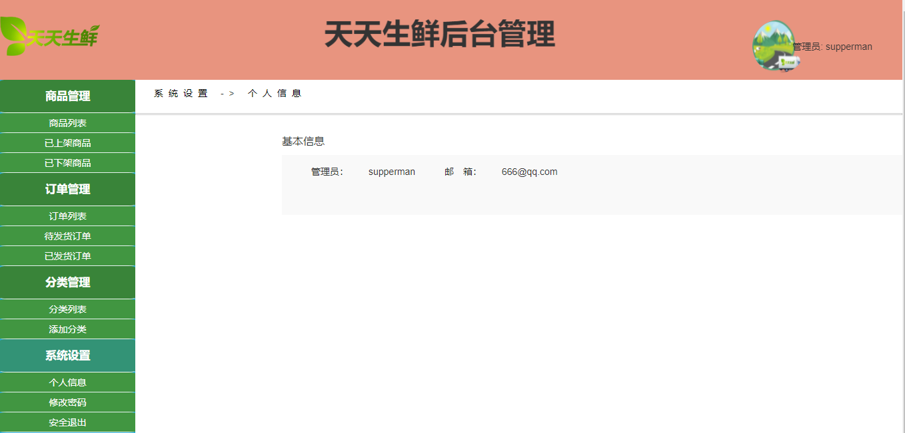
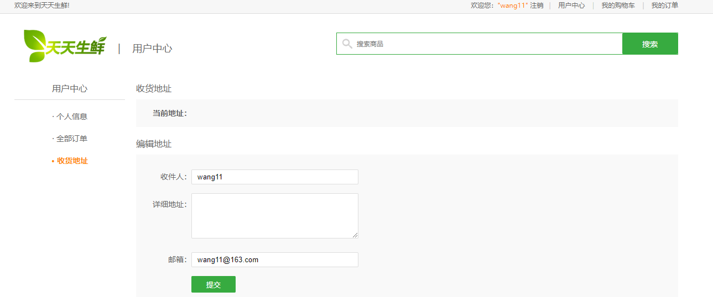
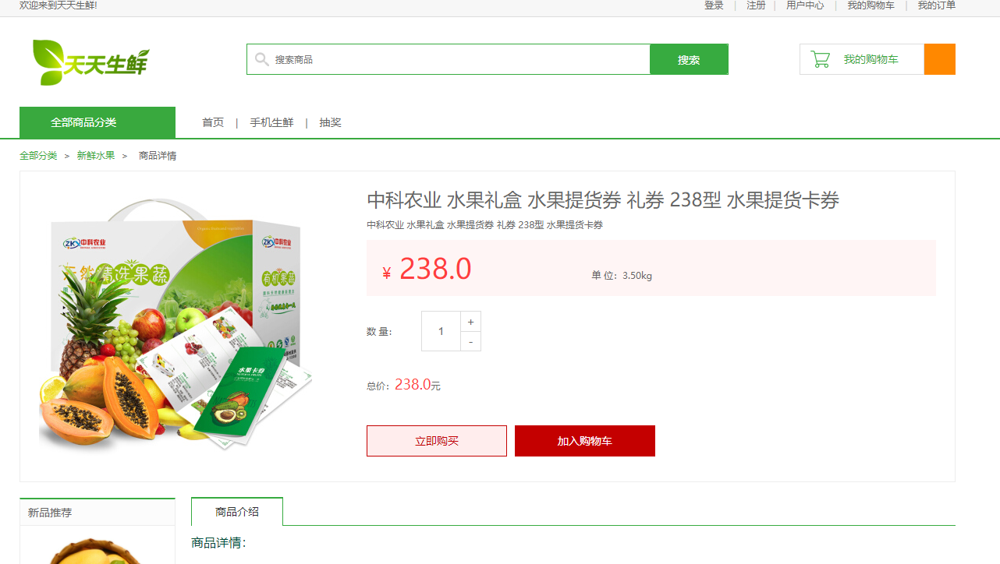

## 基于SpringBoot的生鲜水果商城

###  获取sql数据库文件: 从戎源码网 (https://armycodes.com/) QQ: 386869957 QQ群: 377586148
###  所有系统地址: (https://github.com/YuLin-Coder/AllProjectCatalog) 
###  所有项目以及源代码本人均调试运行无问题 可支持远程安装部署调试、定制修改、代码讲解

## 项目介绍
基于SpringBoot的生鲜水果商城，有用户和管理员两个角色，主要功能如下
生鲜水果商城的功能简介如下：

### 【管理员】:
1. 商品管理：管理员有权限管理商品列表，包括添加新商品、编辑商品信息、上架商品和下架商品。
2. 订单管理：管理员可以查看订单列表，并筛选待发货订单和已发货订单
3. 分类管理：管理员可以管理商品的分类，包括添加、编辑和删除分类

### 【用户】:
1. 生鲜购买：用户可以浏览商城中的生鲜水果商品
2. 生鲜商品分类展示：商品按照分类展示
3. 购物车：用户可以将心仪的商品添加到购物车中
4. 用户中心：用户可以查看自己的订单信息、收货地址、个人资料等，并进行相应的管理和修改。

## 项目技术
- 编程语言：Java
- 数据库：MySQL
- 项目管理工具：Maven
- 前端技术：HTML、CSS、JavaScript、Bootstrap
- 后端技术：Spring、SpringMVC、MyBatis

## 运行环境
- JDK版本：JDK1.8及以上
- 开发工具：IDEA、Ecplise、Myecplise都可以
- 数据库: MySQL5.7及以上
- Maven：maven3.0及以上
- Node：14.14.0及以上

## 运行截图

